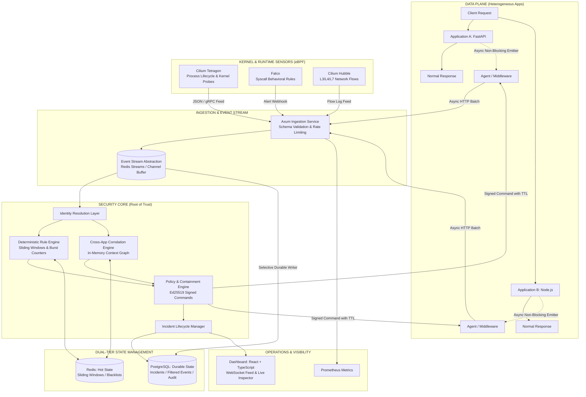

# Distributed Security Control Plane

[](https://www.gnu.org/licenses/agpl-3.0)
[](https://www.rust-lang.org/)
[](https://react.dev/)
[](#core-architectural-invariant)

> **An open-source, out-of-band security control plane that asynchronously collects security telemetry from applications and runtime sensors, resolves identity, correlates activity across services, detects abnormal behavior, and coordinates graduated containment — without placing security analysis on the synchronous application request path.**

**Core idea:** security should observe and act on applications without becoming a dependency of their normal request path.

[Architecture](#system-architecture) · [Trade-offs](#design-trade-offs) · [Quickstart](#quickstart--local-setup) · [Roadmap](#7-phase-development-roadmap) · [Threat Model](THREAT_MODEL.md) · [Contributing](CONTRIBUTING.md) · [Security](SECURITY.md)

---

## Why This Project?

Security signals are distributed across application logs, runtime syscall alerts, kernel process telemetry, and network flow data. Looking at each stream independently misses relationships: a routine login on App A, an API call on App B, and a mass data export on App C only look like one coordinated attack when you correlate across all three.

Existing tools tend to specialize in one layer. This project explores whether a dedicated control plane sitting *beside* applications — not *between* them and their clients — can fuse signals from application middleware, eBPF kernel probes (Tetragon), runtime syscall rules (Falco), and network flows (Hubble) into a unified security context, and then act on it through cryptographically signed, time-bounded, reversible containment commands.

The pieces that make this more than another SIEM are:
- **Capability-based policy model** where `DENY` always beats `ALLOW`, inspired by Deno's permission system.
- **Ed25519-signed containment commands** with mandatory TTLs and replay protection, so enforcement actions are auditable and automatically expire.
- **Graduated, reversible responses** — from session revocation to service isolation, each with explicit rollback.
- **Cross-application identity resolution** that stitches together IPs, session tokens, user IDs, container IDs, and PIDs into a unified entity graph.

```text
APPLICATIONS
    │
    │ asynchronous telemetry
    ▼
SECURITY CONTROL PLANE
    │
    ├── Identity Resolution
    ├── Cross-Application Correlation
    ├── Deterministic Detection
    ├── Risk & Policy
    ├── Incident Management
    └── Containment Coordination
            │
            │ signed command (Ed25519, TTL-bounded)
            ▼
       LOCAL AGENT
            │
            ▼
        ENFORCEMENT
```

---

## Design Trade-offs

This architecture is **detect-and-respond**, not **prevent**. Because security analysis runs out-of-band, the system cannot block the first malicious request inline. An attacker gets some number of requests through before a containment command lands at the local agent. The number that matters is **detection-to-containment latency** — the time between ingesting a suspicious event and the agent enforcing a response.

What you get in return is **zero request-path coupling**: normal application traffic never waits on security analysis, correlation, or the controller. If the control plane goes down, applications continue serving traffic unaffected, and local agents buffer telemetry and continue enforcing cached policies.

This is an explicit trade-off, not a universal improvement over inline security. Inline gateways can block known-bad requests before they reach the application; this system cannot. For threats that require correlating signals across multiple services, time windows, and runtime layers — which inline gateways cannot easily do — the out-of-band model is stronger.

### Core Architectural Invariant
> *"Normal application requests must never wait for security ingestion, correlation, detection, or the security controller."*

---

## What This Is and Isn't

| | This Project | Inline WAF / API Gateway | Falco / Tetragon (standalone) | Wazuh / Elastic Security |
| :--- | :--- | :--- | :--- | :--- |
| **Architecture** | Out-of-band control plane | Inline request path | Per-node agent | Agent + centralized manager |
| **Can block first request?** | No | Yes | Tetragon can (enforcement mode) | No (detect-and-respond) |
| **Cross-app correlation** | Yes (unified entity graph) | Limited | No (node-local) | Log correlation rules |
| **Kernel/runtime visibility** | Ingests Tetragon, Falco, Hubble | No | Native | Agent-based file/process monitoring |
| **Containment model** | Signed, TTL-bounded, reversible | Block/allow rules | Tetragon: kill process | Active response scripts |
| **Application latency impact** | None (async emitter) | Adds to request path | None (kernel-level) | None (log-based) |
| **Policy model** | Capability-based, DENY > ALLOW | Rule-based | Enforcement policies | Rule-based |

**This project does not replace** Falco or Tetragon — it ingests their telemetry and adds cross-application correlation, identity resolution, and graduated containment that those tools don't provide individually. It also does not replace an inline WAF for known-signature blocking.

---

## Project Status

The repository is under active development, organized as a phased security-engineering project.

**Implemented:** Phases 1–5 (architecture, ingestion, detection, identity resolution, cross-app correlation, capability policy engine, signed containment, and kernel/runtime telemetry adapters).

**Planned:** Phase 6 (advisory AI reasoning worker) and Phase 7 (Docker Compose packaging, Prometheus/Grafana, sustained load testing).

> **Note on Phase 5 sensors:** The Tetragon, Falco, and Hubble adapters currently run against simulated payloads modeled on the real JSON formats from each tool's documentation and sample outputs. The normalization logic, field mapping, and canonical event pipeline are fully implemented and integration-tested. Validation against a live kind cluster with real sensor output is planned. The sensor boundary is clean — everything enters through `/api/v1/sensors/*` and normalizes into `SecurityEvent`, so swapping simulated payloads for real feeds is a configuration change, not a code change.

This is an evolving engineering project; APIs, internal interfaces, and deployment assumptions may change as additional phases are implemented.

---

## Technology Stack

| Layer | Technology | Role |
| :--- | :--- | :--- |
| **Kernel & Runtime Telemetry** | eBPF (Cilium Tetragon, Falco, Hubble) | Ingests process execution, syscall alerts, and L3-L7 network flows via REST adapters. |
| **Core Security Engine** | Rust (`tokio`, Axum) | Event ingestion, sliding-window detection, in-memory correlation graph, Ed25519 signed containment. |
| **API & Streaming** | Rust (Axum REST & WebSockets) | Telemetry ingestion endpoints and real-time event streaming to the dashboard. |
| **Hot Operational State** | Redis *(planned — currently in-memory)* | Sliding-window rate counters, active session blacklists, pub/sub. |
| **Durable State** | PostgreSQL *(planned — currently in-memory)* | Partitioned event store, incident records, audit logs. |
| **Operations Dashboard** | React + TypeScript + Vite | Dark-mode dashboard with live WebSocket feed, sensor filtering, and event inspector. |
| **Advisory AI** | Python worker *(Phase 6, planned)* | Off-path advisory assistant for ambiguous incidents. Zero execution privileges. Lowest priority. |
| **Metrics** | Prometheus & Grafana *(Phase 7)* | Control plane latency tracking, queue depth, ingestion rates. |

---

## System Architecture



---

## Performance Characteristics

The telemetry emitter in application middleware is non-blocking and fire-and-forget. A preliminary benchmark harness ([benchmarks/measure_overhead.py](benchmarks/measure_overhead.py)) confirms that 1,000 requests with the emitter active show no statistically significant latency increase over baseline — the mean difference is within noise.

**What still needs measurement** (planned for Phase 7):
- Emitter cost under sustained load (thousands of concurrent connections).
- Behavior when the control plane is unreachable (buffer-full backpressure invariant).
- End-to-end **detection-to-containment latency**: the time from event ingestion to agent enforcement, which is the metric that matters most for this architecture.
- Ingestion throughput at the control plane under realistic sensor volume.

---

## 7-Phase Development Roadmap

The platform is built incrementally through vertical slices:

- [x] **Phase 1: Architecture Core, Ingestion Pipeline & Minimal Observable Slice**
  - Canonical event model with sensor fidelity (Tetragon, Falco, Hubble, Agent).
  - Decoupled Event Stream abstraction & selective durable writer.
  - Non-blocking Python and Node application middleware.
  - Live streaming React + TypeScript dashboard with WebSocket connectivity.
- [x] **Phase 2: Hot State Operational Engine & Deterministic Detection**
  - Sliding-window rate tracking with in-memory ring-buffer.
  - High-confidence deterministic rules (credential brute-force, rapid API enumeration, unauthorized bursts, container shell spawn).
  - Signal accumulation, dynamic risk scoring, automated incident synthesis and lifecycle management.
  - RESTful incident management and real-time WebSocket incident streaming.
- [x] **Phase 3: Identity Resolution, Cross-App Correlation & Capability Context**
  - Canonical entity resolution across heterogeneous identifiers (IP, session token, user ID, container ID, PID).
  - In-memory context graph tracking relationships across applications with automated TTL eviction.
  - Multi-stage cross-application attack sequence detector (Reconnaissance → Lateral Movement → Exfiltration).
  - Capability context inference inspired by Deno's permission model.
- [x] **Phase 4: Capability Policy Engine & Graduated Containment**
  - Fine-grained scoped capability permissions with absolute `DENY` precedence over `ALLOW`.
  - Versioned declarative policy bundles with Mode C dry-run simulation.
  - Ed25519 cryptographically signed containment commands with mandatory TTLs and replay protection.
  - Graduated surgical actions (revoke session, throttle actor, block network, revoke capability, restrict scope, isolate service) with explicit rollback.
  - Local in-process `ContainmentGuard` for sub-millisecond cached enforcement.
- [x] **Phase 5: Kernel & Runtime Telemetry Adapters (Cilium Tetragon, Falco, Hubble)**
  - REST ingestion endpoints: `/api/v1/sensors/tetragon`, `/api/v1/sensors/falco`, `/api/v1/sensors/hubble`.
  - Normalization of raw eBPF/syscall/flow telemetry into canonical `SecurityEvent` with full raw payload preservation (Sensor Fidelity Invariant).
  - High-confidence kernel detection (container shell spawn, syscall anomalies, dropped network egress).
  - *Note: Currently validated against simulated payloads modeled on real sensor formats. Live cluster validation planned.*
- [ ] **Phase 6: Advisory Off-Path LLM Reasoning Service (Mode B)** *(lowest priority)*
  - Optional Python worker for ambiguous, high-entropy incidents.
  - Strict output validation; zero direct execution authority.
- [ ] **Phase 7: Full Stack Observability, Benchmarking & Packaging**
  - Docker Compose deployment with Redis, PostgreSQL, Prometheus, and Grafana.
  - Sustained load testing, detection-to-containment latency benchmarking, and fault injection.

---

## Known Limitations

This project has several unsolved hard problems documented in [THREAT_MODEL.md](THREAT_MODEL.md):

- **Telemetry integrity**: A compromised application can forge or suppress its own telemetry. The system currently trusts emitters.
- **Agent attack surface**: The local agent and its Ed25519 signing keys are themselves targets. Key distribution, rotation, and revocation are not yet implemented.
- **Identity resolution errors**: A false entity merge means an innocent user could be contained. There is no undo mechanism for identity graph corrections.
- **In-memory state**: The context graph and correlation state live in memory. A restart loses all state, and the architecture doesn't yet support horizontal scaling.

These are acknowledged limitations, not solved problems. Documenting them here is intentional.

---

## Quickstart & Local Setup

### 1. Prerequisites
- **Rust**: 1.80+ (`stable` toolchain)
- **Node.js**: 20+ and npm
- **Python**: 3.11+ (for integration tests and benchmarks)

> **Note:** The standalone mode runs fully in-memory — no Redis or PostgreSQL needed. External state stores are planned for Phase 7 and will ship with a Docker Compose configuration.

### 2. Run the Security Control Plane Server
```powershell
cargo run -p security-control-plane
```
The API server listens on `http://localhost:8080` with the WebSocket stream at `ws://localhost:8080/api/v1/ws/events`.

### 3. Launch the Operations Dashboard
```powershell
cd frontend
npm install
npm run dev
```
Open `http://localhost:5173` to view the live dashboard.

### 4. Run the Integration Tests
```powershell
# Rust unit tests (all crates)
cargo test --workspace

# Integration test suites (server must be running)
python tests/test_phase1_slice.py
python tests/test_phase2_engine.py
python tests/test_phase3_correlation.py
python tests/test_phase4_containment.py
python tests/test_phase5_sensors.py
```

### 5. Run the Benchmark
```powershell
python benchmarks/measure_overhead.py
```

---

## Documentation

- [Architecture Overview](docs/ARCHITECTURE.md)
- [Threat Model & Known Limitations](THREAT_MODEL.md)
- [Use Cases](docs/USE-CASES.md)
- [Detection & Correlation](docs/DETECTION-AND-CORRELATION.md)
- [Changelog](CHANGELOG.md)

---

## License

This project is licensed under the **GNU Affero General Public License v3.0 (AGPL-3.0)**. See the [LICENSE](LICENSE) file for full terms.

The AGPL ensures that all modifications — including those deployed as a network service — remain open source and available to the community. See [CONTRIBUTING.md](CONTRIBUTING.md) for contribution guidelines and [SECURITY.md](SECURITY.md) for our vulnerability disclosure policy.
