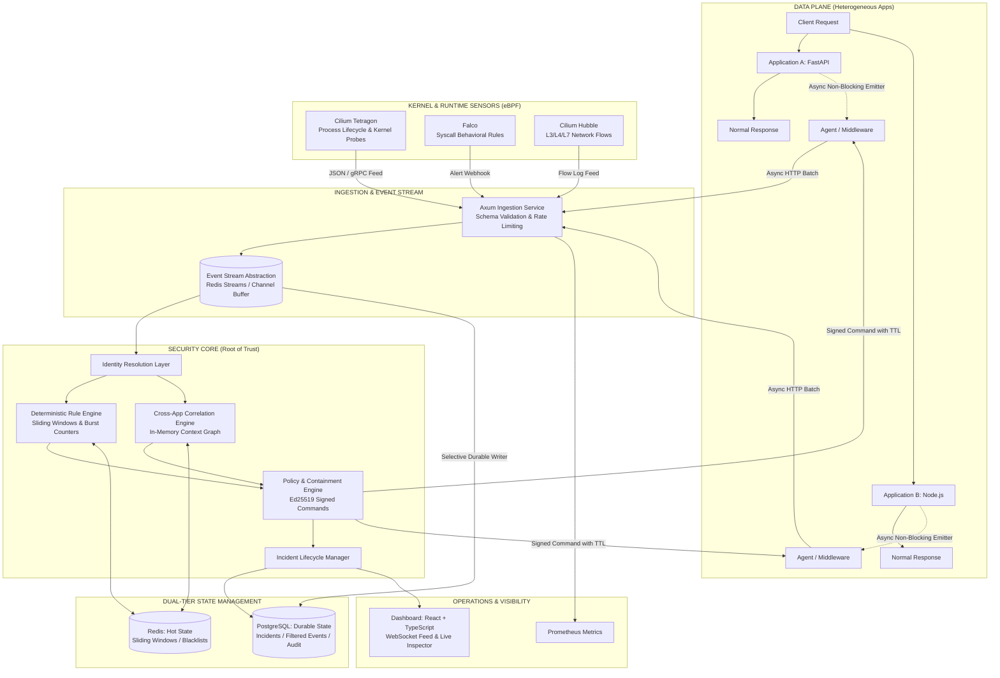

# Distributed Security Control Plane

[](https://www.gnu.org/licenses/agpl-3.0)
[](https://www.rust-lang.org/)
[](https://react.dev/)
[](#core-architectural-invariant)

> **An open-source, out-of-band security control plane for asynchronously collecting security telemetry, resolving identity, correlating activity across applications and runtime layers, detecting abnormal behavior, managing incidents, and coordinating containment without putting security analysis on the synchronous application request path.**

**Core idea:** security should observe and control applications without becoming a dependency of their normal request path.

[Architecture](#system-architecture) · [Quickstart](#quickstart--local-setup) · [Roadmap](#7-phase-development-roadmap) · [Contributing](CONTRIBUTING.md) · [Security](SECURITY.md) · [Wiki](https://github.com/Jaycubic/Distributed-Security-Control-Plane/wiki)

---

## Why This Project?

Security signals are distributed across application, runtime, kernel, and network layers. Looking at each stream independently can miss relationships between events that belong to the same actor, session, workload, or multi-stage attack sequence.

This project explores a control-plane architecture in which applications continue serving normal traffic while a separate security system asynchronously collects telemetry, builds security context, detects suspicious behavior, manages incidents, and coordinates containment.

```text
APPLICATIONS
    │
    │ asynchronous telemetry
    ▼
SECURITY CONTROL PLANE
    │
    ├── Identity Resolution
    ├── Cross-Application Correlation
    ├── Deterministic Detection
    ├── Risk & Policy
    ├── Incident Management
    └── Containment Coordination
            │
            │ signed command
            ▼
       LOCAL AGENT
            │
            ▼
        ENFORCEMENT
```

## Project Status

The repository is under active development and is organized as a phased security-engineering project.

**Implemented:** Phase 1 architecture/ingestion/observable slice, Phase 2 deterministic detection and incidents, and Phase 3 identity resolution, cross-application correlation, and capability context.

**Planned:** graduated containment, direct runtime telemetry adapters, optional off-path advisory AI, and full observability/packaging.

This is an evolving engineering project; APIs, internal interfaces, and deployment assumptions may change as additional phases are implemented.

---

## The Problem with Inline Security

Traditional inline security gateways place security processing directly between the client and the protected application. This can couple application latency and availability to the security layer:

```text
CONVENTIONAL INLINE GATEWAY (Fragile & Latency-Heavy):
Client ──► [ Security Gateway / WAF ] ──► Application ──► Response
               │
               └── Security processing becomes part of the request path
                   and its availability boundary.
```

1. **Every request pays the latency tax**: Complex rule evaluations and external calls delay real users.
2. **Availability hostage**: A crash or network hiccup in the central security gateway takes all downstream applications offline.
3. **Local visibility is blind**: An individual application cannot recognize that a routine login on App A, an API call on App B, and a mass export on App C belong to the same multi-stage credential compromise.

---

## The Out-of-Band Solution

This platform intentionally separates **application availability** from **security intelligence**:

```text
DISTRIBUTED SECURITY CONTROL PLANE (Out-of-Band & Resilient):
Client ──────────────────► Application ──────────────────► Fast Response (<2ms)
                               │
                      Async Telemetry Emitter (Non-blocking, <150µs)
                               │
                               ▼
            ┌──────────────────────────────────────┐
            │       SECURITY CONTROL PLANE         │
            │  - Kernel eBPF Telemetry (Tetragon)  │
            │  - Runtime Alerts (Falco)            │
            │  - Network Flows (Cilium Hubble)     │
            │  - Cross-Application Correlation     │
            │  - Deterministic Risk & Policy       │
            │  - Cryptographic Signed Containment  │
            └──────────────────┬───────────────────┘
                               │
               Instant Containment Command (Ed25519)
                               ▼
                 Local Agent Enforces Action:
                 - Revoke Session Blacklist
                 - Throttle Malicious Actor
                 - Quarantine Compromised Service
```

### Core Architectural Invariant
> *"Normal application requests must never wait for security ingestion, correlation, detection, LLM analysis, or the security controller."*

If the security controller is offline or degraded, **normal application traffic continues operating completely unaffected**. Local agents buffer telemetry and continue enforcing cached emergency policies locally.

---

## Technology Stack

| Layer | Technology | Primary Role |
| :--- | :--- | :--- |
| **Kernel & Runtime Telemetry** | eBPF (Cilium Tetragon, Falco, Hubble) | Zero custom kernel code. Ingests process execution, syscall alerts, and L3-L7 network flows. |
| **Core Security Engine** | Rust (`tokio`, Axum, `crossbeam`) | Ultra-low latency event ingestion, sliding-window rate tracking, and in-memory correlation graph. |
| **Ingestion & Admin API** | Rust (Axum REST & WebSockets) | Microsecond ingestion endpoint (`POST /api/v1/telemetry`) and real-time live event streaming. |
| **Hot Operational State** | Redis | *"What is happening now?"* — sliding-window rate counters, active session blacklists, and pub/sub. |
| **Durable Historical State** | PostgreSQL | *"What happened & what did we decide?"* — partitioned event store, incident records, and audit logs. |
| **Operations Dashboard** | React + TypeScript + Vite | Glassmorphic dark-mode UI with live WebSocket feed, sensor filtering, and event inspector drawer. |
| **Advisory AI Reasoning** | Python service / separate worker | **Mode B (OFF by default)**: Off-path advisory assistant for ambiguous incidents. Zero execution privileges. |
| **Metrics & Observability** | Prometheus & Grafana | Control plane p50/p95/p99 latency tracking, queue depth, ingestion rates, and sensor health. |

---

## System Architecture



---

## Empirical Latency Benchmark Results

A dedicated benchmark harness ([benchmarks/measure_overhead.py](benchmarks/measure_overhead.py)) evaluates the synchronous impact of the non-blocking telemetry emitter across 1,000 requests:

```text
=================================================================
DISTRIBUTED SECURITY CONTROL PLANE: EMPIRICAL OVERHEAD BENCHMARK
Sample Size: 1000 requests
=================================================================
Metric       | Baseline (µs)    | With Telemetry (µs)
----------------------------------------------------------------------
Mean         | 15460.73         | 15261.25
p50          | 15951.60         | 15959.70
p95          | 16139.20         | 16096.60
p99          | 17054.20         | 16573.60
======================================================================
Hard Architectural Invariant Preserved:
Request path does not wait on the security controller.
======================================================================
```

---

## 7-Phase Development Roadmap

The platform is designed to be built incrementally through vertical slices:

- [x] **Phase 1: Architecture Core, Ingestion Pipeline & Minimal Observable Slice**
  - Canonical event model with sensor fidelity (Tetragon, Falco, Hubble, Agent).
  - Decoupled Event Stream abstraction & selective durable writer.
  - Non-blocking Python and Node application middleware.
  - Live streaming React + TypeScript dashboard with WebSocket connectivity.
- [x] **Phase 2: Hot State Operational Engine & Deterministic Detection**
  - Dual-tier hot state storage (`HotStateStore` with Redis sorted sets and zero-dependency in-memory sliding ring-buffer).
  - High-confidence deterministic rules (Credential Brute-Force, Rapid API Enumeration, Unauthorized Bursts, Tetragon Container Kernel Shells).
  - Signal accumulation, dynamic risk scoring (Medium/High/Critical), automated Incident synthesis, and lifecycle state management.
  - RESTful Incident Management endpoints (`GET /api/v1/incidents`, `POST /api/v1/incidents/:id/status`) and real-time WebSocket incident streaming.
  - Operations Dashboard Incidents & Containment Console with one-click containment and attack simulation dispatchers.
- [x] **Phase 3: Identity Resolution, Cross-App Correlation & Capability Context**
  - Canonical entity resolution across heterogeneous identifiers (IP, session token, user ID, container ID, PID).
  - High-performance In-Memory Context Graph (`MemoryContextGraph`) tracking relationships across Application A, B, and C with automated TTL eviction.
  - Multi-stage cross-application attack sequence detector (Reconnaissance $\to$ Lateral Movement $\to$ High-Impact Exfiltration).
  - Deno-inspired capability context inference (`database.read`, `process.execute`, `data.export`, `admin.operation`).
  - RESTful entity and topology endpoints (`GET /api/v1/entities`, `GET /api/v1/correlation/graph`).
  - Frontend Identity & Correlation Console with graph topology inspection and 3-App attack chain simulation.
- [ ] **Phase 4: Graduated Containment System, Signed Commands & Reversible TTLs**
  - Capability-based actions: `REVOKE_SESSION`, `THROTTLE_ACTOR`, `BLOCK_NETWORK`, `ISOLATE_SERVICE`.
  - Ed25519 signed control channel with mandatory TTLs and automated rollback.
- [ ] **Phase 5: Kernel & Runtime Telemetry Adapters (Tetragon, Falco, Hubble)**
  - Direct gRPC/JSON ingestion adapters for Cilium Tetragon, Falco alerts, and Hubble flows.
  - Compound kernel-to-application context correlation.
- [ ] **Phase 6: Advisory Off-Path LLM Reasoning Service (Mode B)**
  - Optional, air-gapped Python worker for ambiguous, high-entropy incidents.
  - Strict Pydantic output validation; zero direct execution authority.
- [ ] **Phase 7: Full Stack Observability, Benchmarking & Packaging**
  - Complete Docker Compose deployment, Prometheus scrapers, and pre-configured Grafana dashboards.
  - Sustained load testing and automated fault injection verification.

---

## Quickstart & Local Setup

### 1. Prerequisites
- **Rust**: 1.80+ (`stable` toolchain)
- **Node.js**: 20+ and npm
- **Python**: 3.11+

### 2. Run the Security Control Plane Server
```powershell
cargo run -p security-control-plane
```
The API server will listen on `http://localhost:8080` with the WebSocket stream at `ws://localhost:8080/api/v1/ws/events`.

### 3. Launch the Operations Dashboard
```powershell
cd frontend
npm install
npm run dev
```
Open `http://localhost:5173` to view the live dashboard.

### 4. Run the Empirical Benchmark
```powershell
python benchmarks/measure_overhead.py
```

### 5. Run the Integration Tests
```powershell
# Phase 1 Slice Verification
python tests/test_phase1_slice.py

# Phase 2 Rust Engine Tests
cargo test -p security-control-plane-engine

# Phase 2 End-to-End Detection & Containment Suite
python tests/test_phase2_engine.py

# Phase 3 Rust Correlator Unit Tests
cargo test -p security-control-plane-correlator

# Phase 3 Cross-Application Correlation & Identity Test Suite
python tests/test_phase3_correlation.py
```

---

## License

This project is licensed under the **GNU Affero General Public License v3.0 (AGPL-3.0)**. See the [LICENSE](LICENSE) file for full terms.

The AGPL ensures that all modifications — including those deployed as a network service — remain open source and available to the community. See [CONTRIBUTING.md](CONTRIBUTING.md) for contribution guidelines and [SECURITY.md](SECURITY.md) for our vulnerability disclosure policy.
