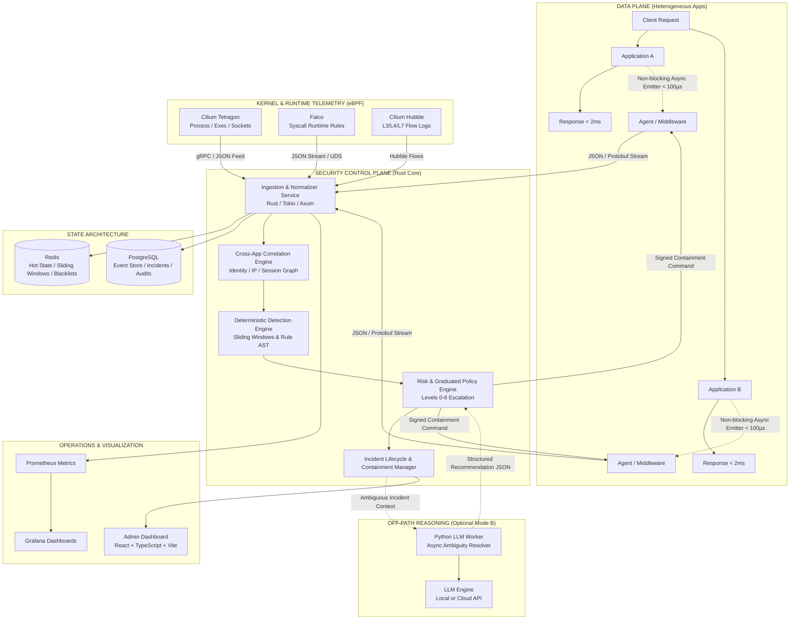

# Distributed Security Control Plane: Master Implementation Plan

A high-performance, out-of-band security intelligence, correlation, and rapid containment platform designed to protect heterogeneous web applications without placing heavy security analysis in the synchronous request path.

---

## User Review Required

> [!IMPORTANT]
> **Key Architectural Alignments:**
> 1. **Zero-Kernel-Code eBPF Strategy**: Rather than writing custom eBPF programs and dealing with kernel verifiers and cross-kernel portability, the platform will consume standardized telemetry from mature CNCF runtime engines (**Cilium Tetragon**, **Falco**, and **Cilium Hubble**), transforming them via Rust normalization adapters into our unified event model.
> 2. **Dual-Tier State Model**: 
>    - **Hot State (Redis)**: Sub-millisecond sliding-window rate limiters, active session revocation blacklists, volatile tenant context, and pub/sub for real-time containment broadcast.
>    - **Persistent State (PostgreSQL)**: Durable event repository, structured incident lifecycle records, cryptographically verifiable audit logs, and versioned security policies.
> 3. **Fail-Open Application Path with Fail-Closed Emergency Policies**: Protected applications run unaffected if the control plane degrades. However, locally cached containment policies (e.g., revoked JWTs or blocked CIDRs) remain actively enforced by local agents even during controller outages.
> 4. **Air-Gapped / Off-Path AI Reasoning (Mode A vs Mode B)**: The system defaults to **Mode A** (100% deterministic, zero LLM dependency). When enabled, **Mode B** runs in an isolated Python background worker; its structured JSON recommendations *must* pass through deterministic Rust policy validation before any containment action is taken.

---

## System Architecture



---

## Phased Implementation Roadmap

To deliver this massive platform reliably, the system is organized into **7 progressive, testable phases**. Each phase produces a working, verifiable milestone.

```
Phase 1: Architecture Core, Unified Schema & Telemetry Foundation
   │
Phase 2: Deterministic Detection Engine & Hot State Tracking
   │
Phase 3: Multi-Application Correlation Engine & Context Graph
   │
Phase 4: Containment Coordination & Graduated Response System
   │
Phase 5: Kernel Runtime Telemetry Integration (Tetragon, Falco, Cilium)
   │
Phase 6: Asynchronous Off-Path LLM Reasoning Service (Python Worker)
   │
Phase 7: Full Stack Observability, Benchmarking & Production Packaging
```

---

### Phase 1: Architecture Core, Unified Schema & Telemetry Foundation

**Primary Objective**: Establish the project repository, standardized event format, zero-copy Rust ingestion pipeline, dual-tier state connection (Redis + Postgres), lightweight application middleware, and a real-time React + TypeScript dashboard skeleton.

#### Core Deliverables:
1. **Unified Security Event Schema (CloudEvents & ECS compatible)**:
   - Event metadata: `event_id`, `timestamp_ns`, `app_id`, `env`, `event_type`.
   - Actor context: `user_id`, `role`, `auth_method`, `session_id`, `client_fingerprint`.
   - Source context: `ip_address`, `geo_country`, `user_agent`, `network_zone`.
   - Action context: `method`, `route`, `status_code`, `duration_us`, `is_success`.
   - Resource context: `resource_type`, `resource_id`, `sensitivity_tier`.
   - Security metadata: `correlation_keys`, `risk_score`, `raw_evidence`.
2. **Rust Control Plane Core (`crates/control-plane`)**:
   - High-throughput asynchronous HTTP/WebSocket ingestion endpoint built with **Axum** + **Tokio**.
   - Dual-sink dispatcher: Fast writes to Redis streams/buffers and batch bulk-insert to PostgreSQL.
3. **Dual-Tier State Layer**:
   - **PostgreSQL**: Normalized schema for `events`, `applications`, `incidents`, `audit_logs` with partitioning on `timestamp`.
   - **Redis**: Connection pooling for ephemeral event queues, telemetry counters, and pub/sub channels.
4. **Lightweight Application Middleware / Emitter**:
   - Python / FastAPI and Node.js / Express reference middleware.
   - Non-blocking asynchronous queueing via worker thread / background task with zero synchronous delay on HTTP requests (budget < 100 µs).
5. **Dashboard Foundation (`frontend/`)**:
   - React + TypeScript + Vite project with Tailwind CSS / glassmorphism dark-mode UI.
   - Live streaming WebSocket connection to the Rust API showing real-time event throughput, application health, and incoming telemetry stream.

---

### Phase 2: Deterministic Detection Engine & Hot State Tracking

**Primary Objective**: Implement sub-millisecond, memory-resident rule evaluation and rate tracking in Rust and Redis to capture known suspicious activity before introducing complex models.

#### Core Deliverables:
1. **Sliding-Window Rate Trackers (Redis + Rust)**:
   - High-performance sliding-log rate tracking using Redis sorted sets (`ZADD`, `ZREMRANGEBYSCORE`, `ZCARD`) or in-memory Rust ring buffers.
   - Tracks metrics per actor, IP, and endpoint: request frequency, failed login density, 4xx/5xx burst rates.
2. **Deterministic Rule Engine (`crates/detector`)**:
   - Rule definition in YAML/JSON:
     * *Brute-Force & Credential Stuffing*: > 10 failed logins in 120s from single IP or identity.
     * *Mass Data Scraping / Sequential Enumeration*: > 50 distinct sequential resource queries (`/records/1`, `/records/2`) within 60s.
     * *Privilege Creep*: Critical administrative endpoint accessed immediately following password reset or session change.
     * *Geographical Velocity Anomaly*: Login from Country B within 15 minutes of an active session in Country A.
3. **Signal Accumulation & Threat Scoring**:
   - Transition events into weighted **Signals**, accumulating rolling risk points per entity.
   - Dynamic decay mechanism for risk scores over time.

---

### Phase 3: Multi-Application Correlation Engine & Context Graph

**Primary Objective**: Break down application silos. Correlate disparate events across Application A, B, and C into cohesive, multi-stage attack chains.

#### Core Deliverables:
1. **Cross-Application Correlation Graph (`crates/correlator`)**:
   - In-memory graph modeling relationships:
     $$\text{Source IP} \longleftrightarrow \text{User Identity} \longleftrightarrow \text{Session ID} \longleftrightarrow \text{Application A/B/C}$$
   - Correlates multi-application attack patterns:
     * *Step 1*: Attacker probes `/api/v1/auth` on App A (triggers weak credential signal).
     * *Step 2*: Uses valid stolen session token on App B to elevate role.
     * *Step 3*: Triggers bulk data export on App C.
2. **Unified Incident State Machine**:
   - Incident states: `OBSERVE` $\to$ `DETECT` $\to$ `CORRELATE` $\to$ `ASSESS` $\to$ `CONTAIN` $\to$ `RECOVER`.
   - Automatic aggregation of raw events into an `Incident Evidence Tree` with chronological timeline and affected entity list.
3. **Incident Timeline Visualization**:
   - React UI visual incident inspector: interactive node graph depicting actor movement across services, timestamps, and confidence score.

---

### Phase 4: Containment Coordination & Graduated Response System

**Primary Objective**: Rapidly enforce surgical countermeasures to halt threat spread while minimizing business disruption.

#### Core Deliverables:
1. **Graduated Response Hierarchy (Levels 0 to 6)**:
   - **Level 0**: Normal logging / passive monitoring.
   - **Level 1**: Elevated telemetry (increase sampling rate for entity).
   - **Level 2**: Security warning / incident generation / admin notification.
   - **Level 3**: Soft containment (force MFA challenge / throttle rate limit to 1 req/s).
   - **Level 4**: Identity containment (instant session token invalidation / user account locked).
   - **Level 5**: Network / host containment (IP drop / egress block on perimeter).
   - **Level 6**: Emergency service quarantine (service placed in read-only / maintenance mode).
2. **Cryptographically Secure Control Channel**:
   - Control commands generated with Ed25519 signatures, timestamp nonce, explicit TTL (e.g. 300s expiration), and unique `command_id`.
   - Agents verify signature before executing revocation, mitigating rogue command injection.
3. **Active Session Blacklist Cache**:
   - Instant revocation broadcast via Redis Pub/Sub to all connected agents.
   - Local agents maintain an in-memory TTL Bloom filter / hash set for instant $O(1)$ rejection of revoked tokens.
4. **Dashboard Response Console**:
   - Operator "One-Click Containment" button: Revoke session, ban IP, isolate user, or revert containment action with full audit recording.

---

### Phase 5: Kernel & Runtime Telemetry Integration (Tetragon, Falco, Cilium)

**Primary Objective**: Ingest kernel-level and container-level telemetry from existing CNCF tools without writing custom eBPF programs, tying kernel syscalls to application-layer identities.

#### Core Deliverables:
1. **Sensor Ingestion Adapters (`crates/sensors`)**:
   - **Cilium Tetragon Adapter**:
     * Ingests Tetragon JSON/gRPC stream (`process_exec`, `process_exit`, `process_kprobe` for system calls, socket connects, namespace escapes).
     * Detects container escapes, unauthorized binary execution (e.g. `curl`, `wget`, `sh` in a web container), and sensitive file access (`/etc/shadow`, Kubernetes service account tokens).
   - **Falco Adapter**:
     * Consumes Falco alerts via JSON output (over Unix Domain Socket or HTTP POST).
     * Maps Falco rules (e.g., "Terminal shell in container", "Read sensitive file untrusted") into platform event signals.
   - **Cilium Hubble Adapter**:
     * Ingests network flow logs: L3/L4 connections, L7 DNS and HTTP drops, unapproved cross-pod lateral movement.
2. **Kernel-to-Application Correlation Linkage**:
   - Uses host metadata, container ID, PID, and request timestamps to connect low-level eBPF events (e.g., `wget` spawned inside container) with the application HTTP request that initiated it.

---

### Phase 6: Asynchronous Off-Path LLM Reasoning Service (Python Worker)

**Primary Objective**: Provide an optional, intelligent investigation assistant for ambiguous, multi-vector incidents without placing any LLM calls on the critical request path.

#### Core Deliverables:
1. **Separation of Modes**:
   - **Mode A (Default - Deterministic)**: 100% operational with LLM turned completely OFF. Zero model latency, zero token cost.
   - **Mode B (Intelligent Assistance)**: Triggered only when rule engines classify an incident as `AMBIGUOUS_HIGH_RISK` or by explicit analyst request.
2. **Python Worker Service (`services/llm-worker`)**:
   - Fast, asynchronous Python service (FastAPI + AsyncIO) listening to an incident review queue in Redis.
   - Aggregates the Incident Context: normalized timeline, affected assets, past actor baselines, triggered rules.
3. **Constrained Structured Output Schema**:
   - Enforces strict JSON output via Pydantic / JsonSchema:
     ```json
     {
       "analysis": "Chronological assessment of lateral movement...",
       "threat_classification": "CREDENTIAL_COMPROMISE_WITH_LATERAL_RECON",
       "confidence_score": 0.88,
       "recommended_response_level": 4,
       "recommended_actions": ["REVOKE_SESSION", "NOTIFY_SOC_TIER_2"],
       "explanation": "Observed failed logins followed by privilege change and unexpected shell execution via Tetragon telemetry."
     }
     ```
4. **Deterministic Policy Validation Gate**:
   - The LLM **never** directly initiates commands.
   - The Rust Policy Engine inspects the recommendation, checks organizational guardrails, and requires automated or human operator approval before execution.

---

### Phase 7: Full Stack Observability, Benchmarking & Production Packaging

**Primary Objective**: Package the system into a repeatable Docker Compose environment with end-to-end metrics, Grafana dashboards, and high-load microsecond latency benchmarks.

#### Core Deliverables:
1. **Full-Stack Docker Deployment (`deploy/docker-compose.yml`)**:
   - Orchestrated containers:
     * `control-plane-api` & `engine` (Rust)
     * `redis` (Hot state / pub-sub)
     * `postgres` (Persistent event & audit store)
     * `dashboard` (React + TypeScript web app)
     * `llm-worker` (Python AI assistant)
     * `prometheus` & `grafana`
     * `mock-apps` (FastAPI / Node web applications emitting live traffic)
     * `sensor-simulator` (Replaying Tetragon, Falco, and Cilium telemetry)
2. **Observability Infrastructure**:
   - Rust Prometheus exporter emitting:
     * `ingestion_events_total`, `ingestion_latency_microseconds` (p50, p95, p99)
     * `correlation_graph_nodes_total`, `detection_eval_duration_us`
     * `containment_dispatch_duration_ms`
     * `agent_backpressure_queue_depth`
   - Pre-provisioned Grafana dashboards for Control Plane Performance, Threat Trends, and System Health.
3. **Benchmarking & Latency Verification Harness**:
   - Load testing scripts (k6 / Rust wrk client) to prove:
     * App synchronous overhead < 150 µs.
     * Ingestion throughput > 50,000 events/second per core.
     * End-to-end detection-to-containment latency < 500 ms.

---

## Directory Structure

```text
d:\AcademicPlanning\SecuritySystem\
├── crates/
│   ├── control-plane/             # Rust API server, Axum HTTP/WS endpoints
│   ├── engine/                    # Detection rules, sliding windows, risk engine
│   ├── correlator/                # Cross-app graph correlation engine
│   ├── sensors/                   # Tetragon, Falco, and Cilium Hubble parsers
│   ├── common/                    # Unified event schema, types, crypto signing
│   └── agent-sdk/                 # Rust agent/middleware client library
├── frontend/                      # React + TypeScript + Vite + Tailwind Admin UI
│   ├── src/
│   │   ├── components/            # Live telemetry feed, incident graph, containment modal
│   │   ├── pages/                 # Overview, Incidents, Applications, Policies, Settings
│   │   └── services/              # WebSocket client, API client
│   └── package.json
├── services/
│   ├── llm-worker/                # Python async service for Mode B incident reasoning
│   │   ├── app/
│   │   │   ├── prompts/           # Guardrailed incident reasoning prompts
│   │   │   ├── schemas/           # Pydantic structured output models
│   │   │   └── worker.py          # Redis queue consumer
│   │   └── requirements.txt
│   └── mock-apps/                 # Sample apps (FastAPI, Node.js) with security SDK
├── deploy/
│   ├── docker-compose.yml         # Full multi-container composition
│   ├── postgres/                  # Init schema, partition DDL, indexes
│   ├── prometheus/                # Prometheus scraper configuration
│   └── grafana/                   # Pre-configured security dashboards
├── benchmarks/                    # k6 / Python latency test harness & simulators
└── docs/                          # Architecture guides and runbooks
```

---

## Verification & Testing Plan

### Automated Testing
1. **Rust Unit & Integration Tests**:
   - `cargo test --workspace`:
     * Event serialization / deserialization roundtrip.
     * Sliding-window rate calculation accuracy under high concurrency.
     * Rule matching engine edge cases (bursts, exact thresholds).
     * Ed25519 signature generation and replay verification.
2. **Python LLM Worker Schema Validation**:
   - `pytest services/llm-worker`: verify strict JSON parsing, fallback logic when model is unresponsive.
3. **Frontend Component Tests**:
   - `npm run test` / `npm run build`: Type-checking and bundle compilation.

### Live System & Latency Verification
1. **Synchronous Impact Measurement**:
   - Run benchmark against mock application: Baseline latency vs. Emitter-enabled latency.
   - Target: Synchronous overhead added by telemetry emitter $\le 150 \ \mu\text{s}$.
2. **End-to-End Incident Containment Test**:
   - Trigger automated attack script:
     * App A: 12 failed logins in 5 seconds.
     * App A: 1 successful login.
     * App B: Immediate access to sensitive endpoint.
     * Sensor: Tetragon reports unauthorized execution inside App B.
   - Verify:
     * Rust engine detects correlated chain.
     * Incident generated with calculated risk $> \text{threshold}$.
     * Signed revocation command sent to App A & B agents.
     * App A & B immediately reject subsequent requests for that session.
     * Total elapsed time from final event to containment execution $\le 500 \ \text{ms}$.
