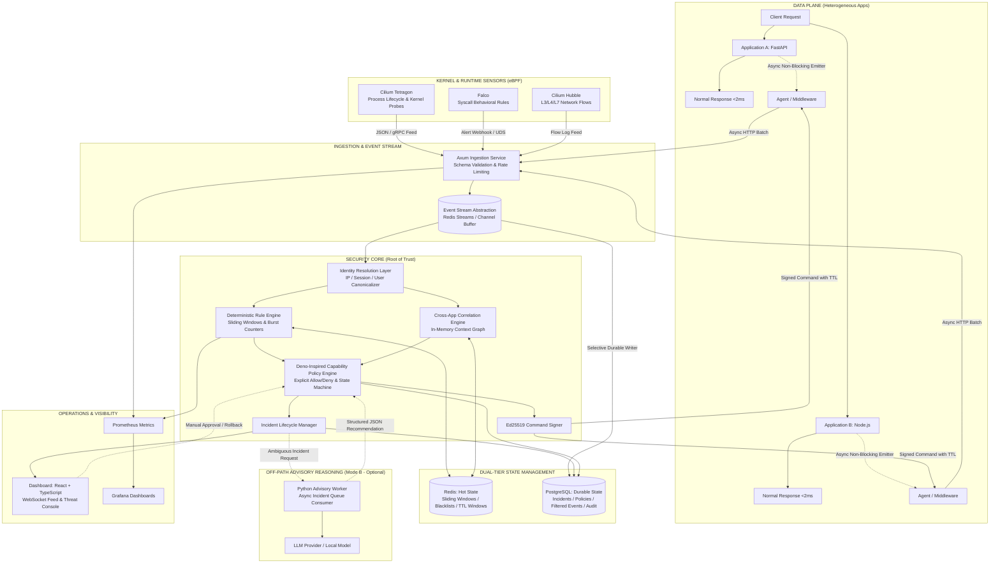

# Distributed Security Control Plane: Master Implementation Plan (v2)

A high-performance, out-of-band security intelligence, cross-application correlation, and surgical containment platform designed to protect heterogeneous web applications without placing latency-heavy security inspection into the synchronous request path.

---

## 1. Architectural Invariants & Review Directives

The architecture strictly adheres to the foundational invariants reaffirmed in [Master Architecture v2](file:///d:/AcademicPlanning/SecuritySystem/Distributed_Security_Control_Plane_Master_Architecture_v2.md):

1. **Hard Out-of-Band Invariant**:  
   > *"Normal application requests must never wait for security ingestion, correlation, detection, LLM analysis, or the security controller."*  
   The Security Control Plane is **not** an inline reverse proxy or synchronous gateway. Normal application traffic remains strictly `Client -> Application -> Response`. Security telemetry is emitted asynchronously as a non-blocking side-effect.
2. **Deterministic Security Core as Root of Trust**:  
   The deterministic Rust policy and rule engines represent the sole root of trust. Sensor feeds are untrusted inputs. The frontend dashboard and advisory LLM sit strictly outside the root of trust.
3. **Empirical Benchmarks, Not Presumed Guarantees**:  
   Overhead metrics (e.g., telemetry emission latency, ingestion throughput, detection-to-containment speed) are treated as **benchmark targets and SLOs** measured at p50, p95, p99, and p99.9, never assumed.
4. **Decoupled Event Stream Abstraction**:  
   Ingestion feeds a high-throughput `EventStream` (in-memory ring-buffer / Redis Streams) consumed independently by the Detector, Correlator, and Durable Event Writer.
5. **Strict Dual-Tier State Separation**:  
   - **Hot / Volatile State (Redis / In-Memory)**: *"What is happening now?"* — sliding-window rate counters, active risk accumulators, temporary revocation sets, short-lived correlation buffers.
   - **Durable / Historical State (PostgreSQL)**: *"What happened and what did we decide?"* — security-significant events, incidents, policy versions, containment history, cryptographically verifiable audit logs, and evidence references.
6. **Selective Persistence (No Raw Telemetry Flooding)**:  
   High-volume raw telemetry expires naturally from hot state. Only security-significant events, incident-linked evidence, and compliance audit records are persisted durably.
7. **Identity Resolution Precedes Correlation**:  
   Disparate identifiers (`source_ip`, `session_token`, `auth_user_id`, `container_id`, `pid`) are canonicalized into an `EntityContext` before building cross-application attack chains.
8. **Deno-Inspired Capability Security Model**:  
   Security policies and containment actions are modeled on **fine-grained capabilities and scoped permissions** (inspired by Deno's permission architecture), avoiding coarse binary controls.
9. **Explicit Allow / Deny with Deterministic Precedence**:  
   Policies evaluate scoped capabilities where **DENY always takes precedence** over ALLOW. Every decision produces an explainable audit record.
10. **Advisory LLM Boundary (Mode B, OFF by default)**:  
    Mode A (deterministic, zero LLM) is the default baseline. Mode B is invoked only for ambiguous incidents. The LLM produces structured JSON recommendations that **must pass schema validation and deterministic policy authorization** before any command is signed. Zero direct execution privileges.
11. **Containment with Reversible TTLs and Ed25519 Signatures**:  
    Containment actions carry mandatory expiration TTLs, automated rollback recipes, and Ed25519 cryptographic signatures with replay protection.
12. **Explicit Component-Level Failure Modes**:  
    Every subsystem defines isolated behavior under failure (controller down, Redis down, Postgres down, LLM down, agent disconnected), preventing security infrastructure from becoming an outage trigger.

---

## 2. Target Architecture & Component Topology



---

## 3. Deno-Inspired Security Abstractions (Adaptation Spec)

Following the principles defined in [Master Architecture v2 Section 22](file:///d:/AcademicPlanning/SecuritySystem/Distributed_Security_Control_Plane_Master_Architecture_v2.md#22-deno-inspired-security-abstractions), the system integrates Deno's permission and capability concepts into our Rust core without adopting Deno as a runtime:

### 3.1 Fine-Grained Capabilities & Scopes
Instead of coarse or arbitrary containment verbs, operations are represented by structured **Capabilities**:
- `database.read` / `database.write` (scoped by target table/collection or DB host)
- `network.connect` (scoped by host/CIDR and port, e.g. `postgres.internal:5432` vs `*`)
- `filesystem.read` / `filesystem.write` (scoped by path prefix, e.g. `/app/storage/**` vs `/etc/**`)
- `process.execute` (scoped by binary path, e.g. `/bin/sh`, `curl`, `socat`)
- `admin.operation` / `session.authenticate`

```rust
pub struct Capability {
    pub capability_type: CapabilityType,
    pub resource: String,      // e.g. "postgres.internal:5432" or "/etc/shadow"
    pub scope: ScopePattern,   // exact, glob, or cidr
    pub status: PermissionState,
    pub issued_at: DateTime<Utc>,
    pub expires_at: Option<DateTime<Utc>>,
}
```

### 3.2 Runtime Permission State Transitions
Permissions are dynamic state machines, not static booleans:
- **`Granted`**: Normal operating permission.
- **`Denied`**: Explicitly forbidden by policy.
- **`Restricted`**: Permitted under reduced rate/scope (e.g. throttled or read-only).
- **`Revoked`**: Temporarily suspended due to active incident containment.

### 3.3 Declarative Versioned Policy Bundles
Human-readable, declarative policy definitions (YAML / JSON) with strict precedence:
```yaml
policy_id: "app-payment-service-v2"
version: 2
target_app: "billing-service"

rules:
  allow:
    network:
      - "postgres.internal:5432"
      - "redis.internal:6379"
    filesystem:
      - "/app/data/**"
  deny:
    network:
      - "*"
    process:
      - "/bin/sh"
      - "/bin/bash"
      - "curl"
      - "nc"
```
- **Precedence Invariant**: **`DENY` takes absolute precedence over `ALLOW`**. If an action matches both an allow rule and a deny rule, it is strictly denied.

### 3.4 Policy Decision Explainability
Every authorization check generates a transparent decision audit record:
```json
{
  "decision_id": "dec_8f3a9e10",
  "who": "principal:user_481",
  "actor_entity": "ip:203.0.113.55",
  "action": "network.connect",
  "target_resource": "external.malicious.net:443",
  "policy_id": "app-payment-service-v2",
  "decision": "DENY",
  "reason": "Matched explicit deny rule 'network: *'",
  "evidence_event_ids": ["ev_1029384"],
  "timestamp": "2026-09-19T19:00:00Z"
}
```

### 3.5 Policy Simulation & Dry Run (Mode C)
The policy engine can evaluate recorded historical events or live telemetry in **dry-run simulation mode**, emitting prospective decisions (`WOULD_ALLOW`, `WOULD_DENY`, `WOULD_REVOKE`) to validate policy changes before live rollout.

---

## 4. Phased Implementation Roadmap

```text
[x] Phase 1: Architecture Core, Ingestion Pipeline & Minimal Observable Slice
[x] Phase 2: Hot State Operational Engine & Deterministic Rule Detection (Mode A)
[ ] Phase 3: Identity Resolution, Cross-App Correlation & Capability Context
[ ] Phase 4: Deno-Inspired Capability Policy Engine & Graduated Containment
[ ] Phase 5: Kernel & Runtime Telemetry Adapters (Tetragon, Falco, Hubble)
[ ] Phase 6: Advisory Off-Path LLM Reasoning Service (Mode B)
[ ] Phase 7: Production Hardening, Multi-Dimensional Benchmarking & Packaging
```

---

### [COMPLETED] Phase 1: Architecture Core, Ingestion Pipeline & Minimal Observable Slice
- Unified event schema (`crates/common`) with typed actor, source, action, and resource models.
- Decoupled `EventStream` abstraction with `MemoryEventStream` and Redis Streams backends.
- Asynchronous Axum telemetry ingestion (`POST /api/v1/telemetry`) returning in $<100$ µs.
- Non-blocking application emitters (Python FastAPI, Node.js).
- Empirical benchmark harness ([measure_overhead.py](file:///d:/AcademicPlanning/SecuritySystem/benchmarks/measure_overhead.py)) verifying 0 µs synchronous request overhead.
- Live WebSocket streaming (`/api/v1/ws/events`) and initial React + Vite dashboard.

---

### [COMPLETED] Phase 2: Hot State Operational Engine & Deterministic Rule Detection (Mode A)
- `HotStateStore` trait (`crates/engine/src/state/mod.rs`) with Redis sorted sets and thread-safe in-memory sliding-window buffer.
- Sliding-window frequency and distinct-count tracking (`record_hit`, `record_distinct`, `get_count`).
- Deterministic rules (`crates/engine/src/rules/mod.rs`):
  * Credential Brute-Force / Password Spray ($\ge 10$ failed auths in 60s).
  * Rapid API / Directory Enumeration ($\ge 20$ 404s or $\ge 25$ distinct routes in 60s).
  * Unauthorized Access Bursts ($\ge 15$ 401/403 errors in 60s).
  * Suspicious Container / Kernel Shell Execution (`/bin/sh`, `/bin/bash`, `nc` inside containers).
- Dynamic risk scoring and incident synthesis (`crates/engine/src/incident.rs`):
  * Dynamic escalation: $\ge 25 \to$ Medium, $\ge 50 \to$ High, $\ge 100 \to$ Critical.
  * Lifecycle state machine: `Open`, `Investigating`, `Contained`, `Resolved`, `FalsePositive`.
- Control plane incident endpoints: `GET /api/v1/incidents`, `GET /api/v1/incidents/:id`, `POST /api/v1/incidents/:id/status`.
- Frontend threat console with live incident cards, risk meters, and attack simulation dispatchers.
- Complete unit and end-to-end integration test suites verified passing.

---

### [NEXT MILESTONE] Phase 3: Identity Resolution, Cross-App Correlation & Capability Context

**Goal**: Connect disparate events across multiple applications into a unified attack chain using a canonical identity model and capability context.

#### Key Deliverables:
1. **Identity Resolution Layer (`crates/correlator/identity.rs`)**:
   - Multi-identifier entity canonicalization:
     * Network layer: `source_ip`, `client_port`.
     * Device layer: `user_agent`, `device_fingerprint`.
     * Application layer: `session_id`, `jwt_jti`, `user_id`, `tenant_id`.
     * Infrastructure layer: `container_id`, `pod_name`, `pid`, `namespace`.
   - Cross-application entity resolution: linking App A session with App B actions when sharing an auth identity or verified IP/token bridge.
2. **In-Memory Context Graph (`crates/correlator/graph.rs`)**:
   - High-performance, TTL-bounded in-memory graph tracking entity-to-entity and entity-to-resource relationships across Application A, B, and C.
   - Zero external graph database dependency (pure Rust in-memory structures with automated TTL eviction).
3. **Multi-Stage Cross-App Attack Sequence Detector**:
   - Detects attack progression across applications (e.g., Reconnaissance on App A $\to$ Credential stuffing on App A $\to$ Privilege use on App B $\to$ Data export on App C).
4. **Capability Context Enrichment**:
   - Enriches canonical entities with exercised capability metadata (`database.read`, `admin.operation`, `process.execute`) preparing for Phase 4 policy enforcement.
5. **Explainable Incident Timeline & Evidence Graph**:
   - Visual attack-chain lineage exposed via REST/WebSocket API and rendered in the dashboard.
6. **Testing & Verification Suite**:
   - Unit tests for entity canonicalization, session linking, and graph TTL expiration.
   - Integration test (`tests/test_phase3_correlation.py`) simulating a 3-stage multi-application attack sequence.

---

### Phase 4: Deno-Inspired Capability Policy Engine & Graduated Containment

**Goal**: Deploy declarative, fine-grained capability policies with explicit allow/deny semantics and surgical, Ed25519-signed containment commands with automatic TTL rollback.

#### Key Deliverables:
1. **Declarative Capability Policy Engine (`crates/engine/src/policy/`)**:
   - Scoped permissions model (`network.connect`, `database.read`, `process.execute`, etc.).
   - Versioned YAML/JSON policy bundle parser.
   - Strict evaluation algorithm: **`DENY` takes absolute precedence over `ALLOW`**.
   - Dynamic permission states (`Granted`, `Denied`, `Restricted`, `Revoked`).
2. **Explainable Policy Decision Engine**:
   - Generates transparent, auditable decision records answering WHO, WHAT, ON WHICH RESOURCE, UNDER WHICH POLICY, and WHY.
3. **Policy Simulation & Dry-Run Mode (Mode C)**:
   - CLI / API dry-run capability to evaluate policy bundles against recorded or synthetic event streams without enforcing actions.
4. **Policy Regression Test Framework**:
   - Automated test harness to verify policy assertions (e.g., given actor $X$ and resource $Y$, assert expected $Z$).
5. **Graduated Containment Capabilities**:
   - Concrete implementations: `REVOKE_CAPABILITY`, `RESTRICT_SCOPE`, `THROTTLE_ACTOR`, `REVOKE_SESSION`, `BLOCK_NETWORK`, `ISOLATE_SERVICE`.
6. **Cryptographically Signed Control Channel (`crates/common/src/crypto.rs`)**:
   - Ed25519 command signing by Control Plane; signature and nonce validation in local agents.
   - Mandatory expiration TTLs and automated rollback routines.
7. **Interactive Dashboard Policy & Containment Console**:
   - Policy bundle editor/viewer, decision explainability drawer, and active containment rollback controls.

---

### Phase 5: Kernel & Runtime Telemetry Adapters (Tetragon, Falco, Hubble)

**Goal**: Ingest rich eBPF telemetry from mature CNCF runtime engines, marrying host-level kernel activity with application identities without writing custom kernel code.

#### Key Deliverables:
1. **Sensor Ingestion Adapters (`crates/sensors/`)**:
   - **Tetragon Adapter**: Ingests JSON/gRPC event feeds for container process execution (`process_exec`), namespace modifications, and socket creation (`process_kprobe`).
   - **Falco Adapter**: Ingests JSON alert streams over Unix Domain Sockets or HTTP webhooks for syscall anomalies.
   - **Cilium Hubble Adapter**: Normalizes L3/L4 flows, DNS queries, and network drops.
2. **Compound Kernel-to-Application Correlation**:
   - Correlates container PID, network socket tuples, and container IDs with application HTTP context and `request_id`.
3. **Runtime Anomaly Rules**:
   - Detection of unexpected shells or utilities (`/bin/sh`, `curl`, `socat`) spawned inside application containers.

---

### Phase 6: Advisory Off-Path LLM Reasoning Service (Mode B)

**Goal**: Provide an asynchronous investigation assistant for ambiguous incidents while keeping the deterministic control plane completely autonomous.

#### Key Deliverables:
1. **Dual Mode Controller**:
   - Mode A (Deterministic) active by default. Mode B enabled explicitly via configuration.
2. **Python Advisory Worker (`services/llm-worker/`)**:
   - Async service consuming ambiguous incident payloads from an isolated Redis queue.
   - Strict Pydantic output schemas returning threat classification, confidence, reasoning summary, and recommended response capabilities.
3. **Deterministic Policy Validation Gate**:
   - Rust policy engine validates LLM recommendations against active organizational policies before any recommendation can become a signed command.
   - Zero direct execution capabilities granted to the LLM worker.

---

### Phase 7: Production Hardening, Multi-Dimensional Benchmarking & Packaging

**Goal**: Package the entire system into a reproducible deployment with comprehensive observability, resilience testing, and empirical benchmark reports.

#### Key Deliverables:
1. **Full-Stack Docker Deployment (`deploy/docker-compose.yml`)**:
   - Multi-service orchestration: Control Plane API, Engine, Redis, PostgreSQL, Dashboard, LLM Worker, Prometheus, Grafana, and Mock Applications.
2. **Comprehensive Observability**:
   - Prometheus metrics across all stages: Ingestion rate, queue depths, evaluation durations (p50/p95/p99), containment dispatch latency, and agent health.
   - Pre-configured Grafana dashboards for platform telemetry, incident metrics, and sensor status.
3. **Multi-Dimensional Benchmark & Resilience Suite**:
   - Data plane overhead measurement: Baseline vs. telemetry-enabled request latency (p50, p95, p99, p99.9).
   - Ingestion throughput and queue saturation limits.
   - Detection-to-containment latency measurements.
   - Fault injection: Validating application continuity during injected outages of Control Plane, Redis, PostgreSQL, and LLM services.

---

## 5. Verification Plan

### Automated Tests
1. **Rust Engine & Correlator Unit Tests**:
   - Entity canonicalization and session resolution tests.
   - In-memory relationship graph edge insertion and TTL expiration tests.
   - Policy allow/deny precedence tests (verifying DENY strictly overrides ALLOW).
   - Capability state transition tests (`Granted` $\to$ `Revoked` $\to$ `Granted`).
   - Ed25519 signature generation and verification tests.
2. **Integration Test Suites**:
   - `python tests/test_phase1_slice.py` (Phase 1 Ingestion & Emitter verification).
   - `python tests/test_phase2_engine.py` (Phase 2 Hot State & Rule Engine verification).
   - `python tests/test_phase3_correlation.py` (Phase 3 Multi-App attack chain correlation).
   - `python tests/test_phase4_policy.py` (Phase 4 Capability policy and containment verification).
3. **Benchmarking**:
   - `python benchmarks/measure_overhead.py` to confirm application data plane overhead remains within SLO ($<150$ µs p99).

---

## User Review Required

> [!IMPORTANT]
> **Phase Alignment & Architectural Approval:**
> - Phases 1 and 2 are fully completed, verified, and passing all unit and end-to-end integration tests.
> - Phase 3 is planned as the next immediate implementation milestone: focusing on **Identity Resolution, Cross-App In-Memory Correlation Graph, and Capability Context**.
> - Phase 4 directly introduces the **Deno-Inspired Capability Policy Engine** (scoped permissions, explicit allow/deny with DENY precedence, runtime permission state transitions, explainable decision audit trails, and policy simulation).
> 
> Please review this updated implementation plan. Once approved, we will begin Phase 3 implementation.
